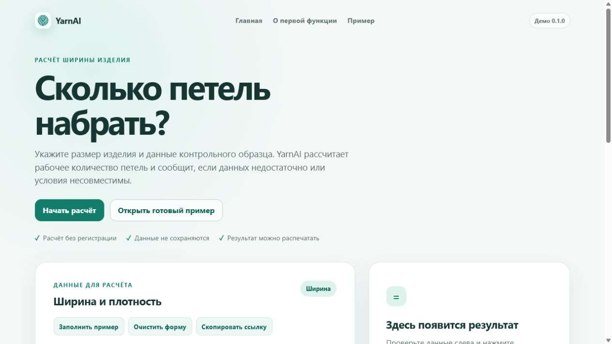
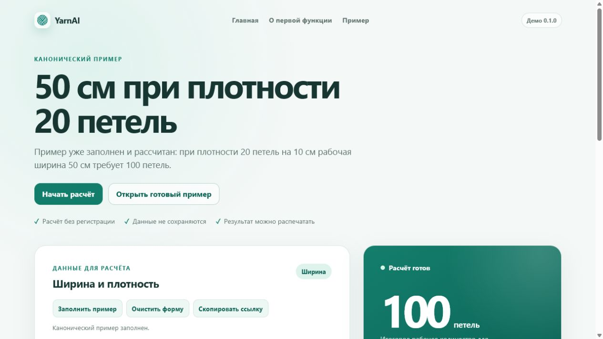
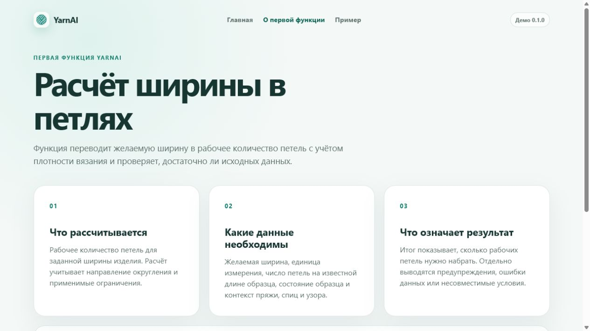

# YarnAI Calculation

`yarnai-calculation` is the standalone calculation core for YarnAI's first
function. Its stable public API is exposed only from the package root:

```python
from yarnai_calculation import calculate
```

Modules below `yarnai_calculation` are implementation details. Applications
should import `calculate`, request models, result models, and enums directly
from `yarnai_calculation`.

## Quick start

YarnAI requires Python 3.12 or newer. From the repository root:

```console
python -m pip install -e ".[test]"
python -m yarnai.http
```

Open `http://127.0.0.1:8000/`. The public demonstration includes:

- `/` — start page and width-calculation form;
- `/about` — what the first function calculates and how to read its result;
- `/example` — the canonical example, filled and calculated automatically;
- `/smart-start` — a step-by-step project start based on a successful result.

No frontend installation or build is required.

## Тестирование пользователями

Установите и запустите приложение из корня репозитория:

```console
python -m pip install -e .
python -m yarnai.http
```

Откройте `http://127.0.0.1:8000/test`. Стартовая страница проводит
тестировщика по существующему пути «расчёт → Smart Start → Step Assistant»,
позволяет продолжить выбранный локальный тест или начать новый.

Прогресс хранится только в `localStorage` текущего браузера. Синхронизации
между устройствами, аккаунтов и серверной базы данных пока нет; очистка данных
браузера удалит прогресс. Обычное действие «Начать заново» удаляет только
текущий расчёт и его прогресс, а полное удаление всех локальных тестов вынесено
в отдельную подтверждаемую секцию на `/test`.

На странице `/feedback` тестировщик может описать проблему, проверить
технический блок без персональных данных и скопировать либо скачать UTF-8
отчёт для передачи владельцу продукта. Отчёт формируется полностью локально и
никуда не отправляется автоматически.

Ограничения тестовой версии: нет облачной синхронизации, аккаунтов, аналитики,
AI, голоса, камеры и фотоанализа. Доступен только уже реализованный сценарий
расчёта ширины, подготовки старта и пошагового счётчика.

## Public demonstration







The demonstration uses packaged HTML, CSS, and vanilla JavaScript. It can fill
or clear the canonical example, copy a shareable URL containing the current
form values as query parameters, print the form and result, and continue a
successful result in Smart Start. JavaScript is required for filling,
calculating, and Smart Start; the pages show an explicit message when it is
disabled.

Smart Start is a deterministic six-step workflow. After a successful final
calculation, choose **Начать вязание** to check the project inputs, prepare
materials, confirm the supplied gauge, cast on and recount the calculated
stitches, and record readiness to follow the project's own first-row
instructions. The latest successful calculation and its per-calculation
progress are stored in browser `localStorage`; no account or server database
is used.

The application version is shown in the header and footer. The calculation
core does not currently expose an independent public version value, so the UI
does not invent or display one.

## Публичное развёртывание

Репозиторий содержит Render Blueprint в файле `render.yaml`. Он создаёт
Python Web Service на бесплатном плане, устанавливает проект командой
`pip install -e .`, запускает штатную команду `python -m yarnai.http` и использует
`/health` для health checks.

Чтобы развернуть приложение, владелец должен опубликовать ветку `main` в
репозитории GitHub, GitLab или Bitbucket, доступном его аккаунту Render. Затем
в Render Dashboard нужно выбрать **New > Blueprint**, подключить Git-провайдера,
выбрать репозиторий YarnAI и подтвердить создание Blueprint из корневого
`render.yaml`. После успешного первого deploy Render покажет постоянный HTTPS
адрес сервиса. Blueprint включает автоматический deploy новых коммитов ветки
`main`.

У созданного сервиса доступны следующие публичные пути:

- `/` — форма расчёта;
- `/about` — описание первой функции;
- `/example` — автоматически заполненный и рассчитанный пример;
- `/smart-start` — пошаговая подготовка начала проекта по готовому расчёту;
- `/health` — машиночитаемый health endpoint с ответом `{"status":"ok"}`.

Ожидаемая форма адреса — `https://<render-service-subdomain>.onrender.com`;
точный адрес появляется только после фактического создания сервиса и поэтому
здесь заранее не публикуется.

Бесплатный Render Web Service останавливается после 15 минут без входящего
HTTP-трафика. Первый запрос после простоя может запускать сервис около минуты.
Платные instance types не имеют этого cold start. Актуальные ограничения
описаны в [официальной документации Render](https://render.com/docs/free).

## Purpose of the first function

The first function converts a requested finished width or measurement into a
working stitch count. It needs the requested width, gauge, swatch state,
knitting context, and yarn/tool context. A successful result is the working
number of stitches to cast on; warnings and diagnostics explain incomplete,
incompatible, or unsupported inputs.

For the canonical example, a width of 50 cm at 20 stitches per 10 cm produces
100 working stitches.

## First-version limitations

- Only width calculation and its deterministic Smart Start workflow are
  demonstrated.
- Smart Start saves only the latest successful calculation and progress in the
  current browser. It does not provide project accounts, cloud history, or
  cross-device synchronization.
- The demonstration does not replace making and measuring a representative
  swatch.
- There is no authentication, database, analytics, or cloud integration.
- Photo recognition, camera verification, voice assistance, and AI checking
  are not implemented. Smart Start does not generate a full pattern or choose
  an unknown cast-on technique.
- Shareable URLs contain form inputs in plain query parameters and should not
  be used for sensitive information.
- The independent calculation-core version is not displayed because the core
  does not currently publish one through its stable public API.

## Installation

For local product integration, install the package from the repository root:

```console
python -m pip install -e .
```

This installs the calculation package and the Starlette/Uvicorn dependencies
used by the HTTP service. To install the dependencies needed to run the test
suite as well:

```console
python -m pip install -e ".[test]"
```

The package requires Python 3.12 or newer.

## Minimal example

```python
from yarnai_calculation import (
    Axis,
    CalculationRequest,
    Direction,
    FabricContext,
    FunctionalCategory,
    GaugeInput,
    GaugeMethod,
    GaugeSource,
    KnittingMode,
    PatternClass,
    ProcessingState,
    SizeKind,
    SwatchContext,
    SwatchMode,
    TriState,
    Unit,
    WidthRequest,
    calculate,
)

fabric = FabricContext(
    yarn="example yarn",
    yarn_batch="batch-1",
    strands=1,
    strands_description="one strand",
    needle_mm=4,
    needle_type="metal circular",
    pattern="stockinette",
    mode=KnittingMode.FLAT,
    processing="wash and dry flat",
)
swatch = SwatchContext(
    off_needles=TriState.YES,
    processing_state=ProcessingState.AFTER,
    fully_dry=TriState.YES,
    rest_hours=12,
    measurement_state="relaxed",
    fabric=fabric,
    mode=SwatchMode.FLAT,
    heavy_or_large=TriState.NO,
)
gauge = GaugeInput(
    method=GaugeMethod.READY_VALUE,
    source=GaugeSource.PERSONAL_SWATCH,
    ready_count=20,
    base_length=10,
    source_measurement_count=3,
    context=swatch,
)
request = CalculationRequest(
    axes=frozenset({Axis.WIDTH}),
    functional_category=FunctionalCategory.ORDINARY,
    knitting_mode=KnittingMode.FLAT,
    zone_pattern="stockinette",
    pattern_class=PatternClass.CONSTANT,
    zone_homogeneous=TriState.YES,
    fabric_context=fabric,
    width=WidthRequest(
        size_kind=SizeKind.FINISHED,
        value=50,
        unit=Unit.CM,
        direction=Direction.NEAREST,
        gauge=gauge,
    ),
)

result = calculate(request)
selected = result.axes[Axis.WIDTH].selected_candidate
print(result.status.name)
print(selected.working_count if selected else None)
```

For this exact input, the selected width is 100 stitches.

## YarnAI application integration

The first application boundary is exposed separately from the calculation
core:

```python
from yarnai import run_first_function
from yarnai_calculation import CalculationRequest

request: CalculationRequest = ...
output = run_first_function(request)
```

`run_first_function` accepts the public `CalculationRequest` contract and
calls only `yarnai_calculation.calculate`. It converts the complete core result
to `FirstFunctionOutput`; domain outcomes such as invalid input, impossible
calculations, and out-of-scope requests remain ordinary result statuses.

Passing a value that is not a `CalculationRequest` raises
`InvalidCalculationRequestError`. If an unexpected technical exception escapes
the core, the boundary raises `CalculationCoreError` with the original
exception available as `original_exception` and as the chained `__cause__`.
Application code never imports modules below `yarnai_calculation`.

## First-function command line interface

Run the first executable vertical slice from the repository root:

```console
python -m yarnai [--input PATH]
```

The command uses only the public `yarnai` integration API. It writes a
calculation result as JSON to stdout and errors as JSON to stderr. Decimal
result values are serialized as strings so that no precision is lost. The
top-level `status` uses stable enum names such as `READY`,
`READY_WITH_WARNINGS`, and `INPUT_ERROR`; complete domain diagnostics,
warnings, clarifications, and invariant traces remain in the response.

The repository contains a working canonical width example at
`examples/first_function_width.json`. Run it from a file:

```console
python -m yarnai --input examples/first_function_width.json
```

Omit `--input`, or use `--input -`, to read JSON from stdin. For example, in
PowerShell:

```console
Get-Content -Raw examples/first_function_width.json | python -m yarnai
```

On shells with input redirection:

```console
python -m yarnai < examples/first_function_width.json
```

The canonical example produces a complete response whose key fields are:

```json
{
  "status": "READY",
  "final": true,
  "canon_version": "1.0",
  "specification_version": "1.0",
  "axes": {
    "width": {
      "selected_candidate": {
        "working_count": 100,
        "visible_count": "100",
        "actual_size_cm": "50"
      }
    }
  },
  "errors": [],
  "warnings": [],
  "clarifications": []
}
```

This is a shortened view of the successful JSON: the actual response also
contains normalized inputs, gauge assessment, neighboring candidates,
explanations, and the full invariant trace.

## First-function HTTP API

After installation, start the local HTTP service with the public command:

```console
python -m yarnai.http
```

The service listens at `http://127.0.0.1:8000` by default. Set `PORT` to change
the listening port
and `YARNAI_HOST` to change the listening address. Render sets
`YARNAI_HOST=0.0.0.0` through the Blueprint and supplies `PORT`.

### Demonstration web interface

The HTTP service also serves the public demonstration of the first
width-calculation function. Start it with:

```console
python -m yarnai.http
```

Then open `http://127.0.0.1:8000/` in a browser. The pages use only packaged
HTML, CSS, and vanilla JavaScript; it has no frontend build step or external
frontend dependencies. Every calculation is sent to the existing
`POST /api/v1/calculate` endpoint.

Use **Заполнить пример** to restore the values from
`examples/first_function_width.json`, **Очистить форму** to remove all values,
and **Скопировать ссылку** to copy the current form as a shareable URL. Open
`http://127.0.0.1:8000/example` to load and calculate the canonical example
automatically; the result is **100 петель**.

After any successful final calculation, **Начать вязание** opens
`http://127.0.0.1:8000/smart-start`. The page uses the actual public result and
normalized inputs, restores progress for that calculation after reload, and
starts a separate sequence when the calculation changes. Opening the route
without an available successful result shows a return link to the calculator.

The interface treats the main domain statuses as user-facing states:

- `READY` and `READY_WITH_WARNINGS` show the selected working stitch count;
- `INPUT_ERROR` asks the user to correct the supplied data;
- `IMPOSSIBLE` explains that the requested conditions are incompatible;
- warnings are shown in a separate notice;
- HTTP `400`, `422`, and `500`, network failures, and incomplete responses
  produce safe messages without tracebacks or internal exception details.

Smart Start is intentionally limited to safe start preparation. It does not
provide photo or voice features, AI verification, a complete garment
description, or instructions for a first row that are absent from the input.

Check its health:

```console
curl.exe http://127.0.0.1:8000/health
```

Send the canonical example with curl:

```console
curl.exe --request POST http://127.0.0.1:8000/api/v1/calculate --header "Content-Type: application/json" --data-binary "@examples/first_function_width.json"
```

Or send the same request from PowerShell:

```powershell
$body = Get-Content -Raw examples/first_function_width.json
Invoke-RestMethod `
  -Uri http://127.0.0.1:8000/api/v1/calculate `
  -Method Post `
  -ContentType "application/json" `
  -Body $body
```

The successful response is the complete structured first-function result. Its
key fields for the canonical example are:

```json
{
  "status": "READY",
  "final": true,
  "axes": {
    "width": {
      "selected_candidate": {
        "working_count": 100
      }
    }
  },
  "errors": [],
  "warnings": []
}
```

| HTTP status | Meaning |
| ---: | --- |
| `200` | The calculation returned a structured domain result. This includes `READY`, `INPUT_ERROR`, `IMPOSSIBLE`, and other normal domain statuses. |
| `400` | The request body is not valid JSON. |
| `422` | The JSON is valid but does not match the YarnAI application input contract. |
| `500` | A technical failure occurred in the integration layer, calculation core, or result serialization. |

Domain errors are not HTTP failures: they are returned with HTTP `200` and
remain available through `status`, `final`, `errors`, `warnings`, and the rest
of the structured result.

## Verification

Run the UI smoke test:

```console
python -m pytest tests/integration/test_demo_smoke.py
```

Run all tests and compile every Python module:

```console
python -m pytest
python -m compileall -q src tests
```

## CLI exit codes

| Code | Meaning |
| ---: | --- |
| `0` | The calculation completed and returned structured JSON. This includes ordinary domain outcomes such as `INPUT_ERROR`, `IMPOSSIBLE`, or `CONFIRMATION_REQUIRED`. |
| `2` | User input could not be read or parsed, or its JSON shape does not match the application contract. |
| `3` | A technical failure occurred in the integration layer, calculation core, or result serialization. |

## Production и нагрузочная проверка

Единственная поддерживаемая production-команда:

```console
python -m yarnai.http
```

Для локальной проверки Render-подобного запуска в PowerShell:

```powershell
$env:PORT = "8000"
$env:YARNAI_HOST = "0.0.0.0"
$env:YARNAI_LOG_LEVEL = "info"
python -m yarnai.http
```

`PORT` по умолчанию равен `8000`, `YARNAI_HOST` — `127.0.0.1`,
`YARNAI_LOG_LEVEL` — `info`. Допустимые уровни: `critical`, `error`,
`warning`, `info`, `debug`. Production-команда всегда запускает один процесс
uvicorn без debug, reload и доверия произвольным forwarded-заголовкам.
HTML и API используют относительные same-origin URL, поэтому домен не
зашит в приложение и HTTPS за reverse proxy не создаёт mixed content.

Статические файлы получают `Cache-Control: public, max-age=0,
must-revalidate`, HTML — `no-cache`, а `/health` и
`POST /api/v1/calculate` — `no-store`. Health check возвращает HTTP 200,
`application/json` и точное тело `{"status":"ok"}`.

Полная нагрузочная проверка запускается отдельно от pytest против уже
работающего production-процесса:

```console
python tools/load_test.py --base-url http://127.0.0.1:8000 --profile all --pid <PID>
```

Короткий smoke-режим:

```console
python tools/load_test.py --base-url http://127.0.0.1:8000 --profile smoke
```

Фактические локальные результаты от 30 июля 2026 года (Windows, один процесс
uvicorn; это не замер сети или инфраструктуры Render):

| Профиль | Запросы | Успешно | Ошибки / 5xx / таймауты | min, ms | median, ms | p95, ms | max, ms | Длительность | Пропускная способность |
| --- | ---: | ---: | ---: | ---: | ---: | ---: | ---: | ---: | ---: |
| A: 20 пользователей × 10 циклов | 1600 | 1600 | 0 / 0 / 0 | 1.785 | 49.079 | 64.666 | 585.493 | 4.293 s | 372.715 req/s |
| B: 50 пользователей × 5 циклов | 2000 | 2000 | 0 / 0 / 0 | 15.101 | 117.892 | 143.997 | 167.373 | 4.687 s | 426.748 req/s |
| C: по 100 запросов на health, `/` и расчёт | 300 | 300 | 0 / 0 / 0 | 12.989 | 203.183 | 232.064 | 249.424 | 0.668 s | 449.239 req/s |

В профиле A p95 расчёта составил 38.354 ms, `/health` — 30.613 ms,
главной страницы — 61.585 ms. Первый параллельный прогрев `/test` дал
локальный p95 563.903 ms; последующие лёгкие GET-маршруты оставались
пригодными для интерактивного интерфейса. Дополнительная проверка выполнила
200 параллельных расчётов: пользователь A стабильно получил 100 петель,
пользователь B — 80, ответы и их контрольные суммы не смешивались.

RSS процесса: 38.547 MiB до нагрузки, 113.527 MiB в пике, 53.242 MiB сразу
после и 53.242 MiB спустя 10 секунд без дальнейшего роста. Процесс оставался
один; число потоков выросло с 5 до 17 и стабилизировалось на 17 из-за пула
раздачи файлов. После всех профилей сервер продолжил отвечать точным health
контрактом. В production-журнале не было 5xx или необработанных исключений.

`render.yaml` описывает бесплатный Python Web Service:

- build command: `pip install -e .`;
- start command: `python -m yarnai.http`;
- health check path: `/health`;
- Python: последняя patch-версия ветки 3.12 из `.python-version`;
- environment: Render предоставляет `PORT`, Blueprint задаёт
  `YARNAI_HOST=0.0.0.0` и `YARNAI_LOG_LEVEL=info`;
- persistent disk и база данных не нужны.

Чтобы развернуть сервис, подключите репозиторий как Blueprint в Render и
подтвердите `render.yaml`. Фактический deployment при этой проверке не
выполнялся: авторизованная сессия Render не предоставлена.

Текущие ограничения: один процесс и локальный браузерный progress-state без
межустройственной синхронизации; бесплатный Render instance имеет cold start
и не является SLA-площадкой. Проверены 20 и 50 одновременных пользователей и
короткий всплеск 300 запросов; более высокий масштаб не заявляется.
